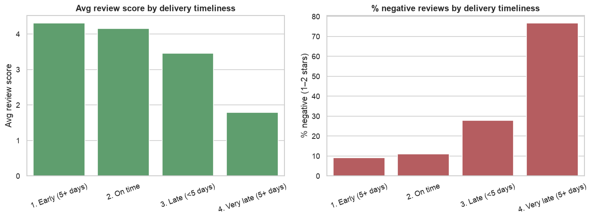
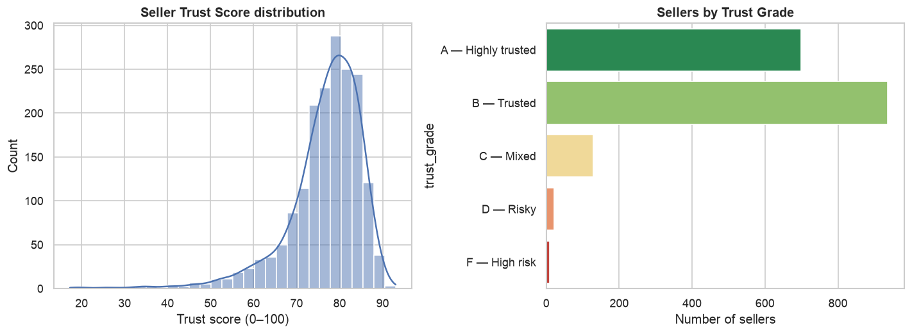

# 🛒 OlistTrust — Marketplace Trust & Review Intelligence

An **end-to-end data analytics & data science project** on the real
[Brazilian Olist e-commerce dataset](https://www.kaggle.com/datasets/olistbr/brazilian-ecommerce)
(~100k orders, 9 relational tables). It goes from raw CSVs → a **SQL data warehouse** →
**EDA** → **machine learning** → **deep learning** → **NLP** → an original, explainable
**Seller Trust Score** → an interactive **Streamlit dashboard**.

> **The story:** what makes customers trust (or distrust) a marketplace seller, can we
> predict a bad experience *before* the review is written, and can we rank every seller
> with a single transparent score?

---

## ✨ Why this stands out on a CV

This isn't a one-notebook Titanic clone. It demonstrates the **full analytics + DS stack**
a hiring manager looks for, on a genuinely relational dataset:

| Skill area | What's demonstrated here |
|---|---|
| **SQL** | 9-table SQLite warehouse, indexes, **VIEWs**, CTEs, window functions, 6 analytical queries |
| **Data wrangling** | pandas ETL, feature engineering across joined tables, parquet artifacts |
| **EDA / viz** | matplotlib, seaborn, Plotly; 5 saved figures telling a clear data story |
| **Machine learning** | Logistic Regression, **XGBoost**, **LightGBM** with a leakage-free time split |
| **Deep learning** | a **TensorFlow / Keras** neural net on the same task |
| **NLP** | Portuguese sentiment — custom lexicon (with negation) **+** TF-IDF + LogReg (**0.96 ROC-AUC**) |
| **Explainability** | **SHAP** global feature importance on the production model |
| **Product thinking** | an original **Seller Trust Score** (0–100, weighted, fully transparent) |
| **Engineering** | clean `src/` package, `config.yaml`, one-command pipeline, **pytest** suite, Streamlit app |

---

## 📈 Visual EDA

**👉 See the full illustrated walkthrough: [`reports/EDA.md`](reports/EDA.md)** — six
annotated figures telling the marketplace's data story (it renders right here on GitHub).

| | |
|---|---|
|  |  |
| *Late deliveries crater review scores* | *Seller Trust Score separates good from high-risk sellers* |

---

## 📊 Headline results


* **Late delivery is the #1 driver of dissatisfaction.** Orders delivered *5+ days late*
  average a **1.79★** review with **76.7% negative**, vs **4.31★** for orders that arrive
  early — quantified directly in SQL.
* **Negative-review prediction:** XGBoost reaches **ROC-AUC ≈ 0.71** predicting a bad
  review from order/delivery/seller features (honest result on a held-out *future* test set).
  A **Keras MLP** independently lands at **ROC-AUC ≈ 0.715** on the same split — a nice
  cross-check that the gradient-boosted and neural approaches agree.

* **Review NLP:** a TF-IDF + Logistic Regression model classifies negative Portuguese
  reviews at **ROC-AUC ≈ 0.96 / 90% accuracy**.
* **Trust Score:** 1,794 sellers ranked 0–100; top sellers score ~93 (5★, 100% on-time),
  high-risk sellers fall below 25.
* **SHAP** confirms the model's logic: `delivery_days` ≫ `seller_avg_review_hist` >
  `estimated_delivery_days` are the dominant features.

---

## 🗂️ Project structure

```
olist-trust/
├── config.yaml                # central config (paths, target, Trust Score weights)
├── requirements.txt
├── run_pipeline.py            # one-command end-to-end pipeline
├── sql/
│   └── analytics.sql          # 6 named analytical queries (CTEs, window fns)
├── src/
│   ├── utils/config.py        # config + path helpers
│   ├── etl/
│   │   ├── build_database.py  # CSVs -> SQLite (indexes + VIEWs)
│   │   └── queries.py         # run named queries / arbitrary SQL
│   ├── features/build_features.py   # SQL-driven order feature matrix
│   ├── models/
│   │   ├── train_ml.py        # LogReg / XGBoost / LightGBM (time split)
│   │   ├── train_dl.py        # TensorFlow / Keras MLP
│   │   └── explain.py         # SHAP importance
│   ├── nlp/sentiment.py       # PT lexicon + TF-IDF classifier
│   ├── trust/trust_score.py   # the Seller Trust Score
│   └── eda.py                 # saves the 5 EDA figures
├── app/dashboard.py           # Streamlit dashboard (6 tabs)
├── tests/test_pipeline.py     # pytest suite
└── scripts/download_data.sh   # fetch the 9 raw CSVs
```

---

## 🚀 Quickstart

```bash
# 1. (one time) create the environment — TensorFlow needs Python 3.10–3.12
python3.12 -m venv .venv
source .venv/bin/activate
pip install -r requirements.txt

# 2. download the data (9 CSVs -> data/raw/)
bash scripts/download_data.sh

# 3. run the whole pipeline (DB -> features -> ML -> SHAP -> NLP -> Trust -> EDA)
python run_pipeline.py            # fast (skips DL)
python run_pipeline.py --with-dl  # also trains the Keras model

# 4. launch the dashboard
streamlit run app/dashboard.py
```

Run the tests any time:

```bash
pytest -q
```

---

## 🧠 Methodology notes

* **Leakage-free evaluation.** ML/DL models use a **time-based split** (train on earlier
  orders, test on later ones) — a random split would leak future information and inflate
  metrics. Class imbalance (~21% negative) is handled with class weights.
* **Target.** `is_negative = review_score <= 3` (configurable in `config.yaml`).
* **Trust Score.** A weighted blend of six normalized components (avg review, on-time rate,
  complaint rate, delivery speed, order volume, cancellation penalty). Every weight lives in
  `config.yaml` and every seller's score is fully decomposable in the dashboard — no black box.
* **Portuguese NLP.** Reviews are in Brazilian Portuguese, so English models don't apply.
  We pair a transparent hand-built lexicon (with negation handling) with a supervised
  TF-IDF model that learns the most predictive positive/negative terms.

---

## 🖥️ Dashboard tabs

1. **Overview** — KPIs, review distribution, monthly volume, top categories
2. **Delivery Insights** — the delivery→satisfaction story + state performance
3. **Seller Trust** — searchable leaderboard + per-seller score breakdown
4. **Review NLP** — sentiment mix + a live Portuguese sentiment scorer
5. **Risk Predictor** — interactive negative-review probability + SHAP importance
6. **SQL Explorer** — run the saved queries or your own SELECT against the warehouse

---

## 📦 Dataset

*Brazilian E-Commerce Public Dataset by Olist* — ~100k orders (2016–2018) across
customers, orders, items, payments, reviews, products, sellers and geolocation.
Licensed CC BY-NC-SA 4.0. Raw files are **not** committed; fetch them with
`scripts/download_data.sh`.

---

## 🔧 Tech stack

Python 3.12 · pandas · NumPy · SQLite · scikit-learn · XGBoost · LightGBM ·
TensorFlow/Keras · SHAP · NLTK · matplotlib · seaborn · Plotly · Streamlit · pytest
