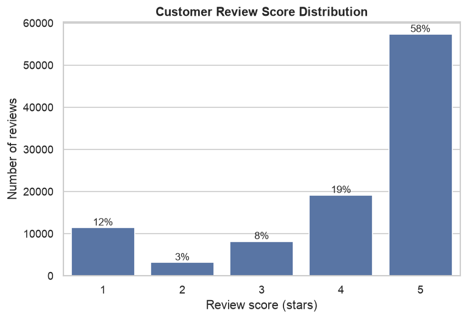
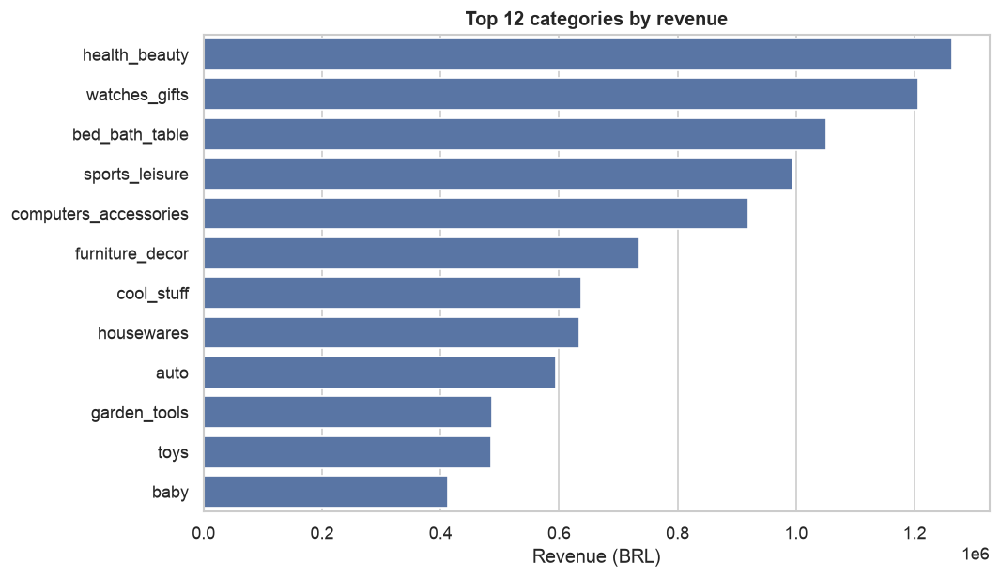
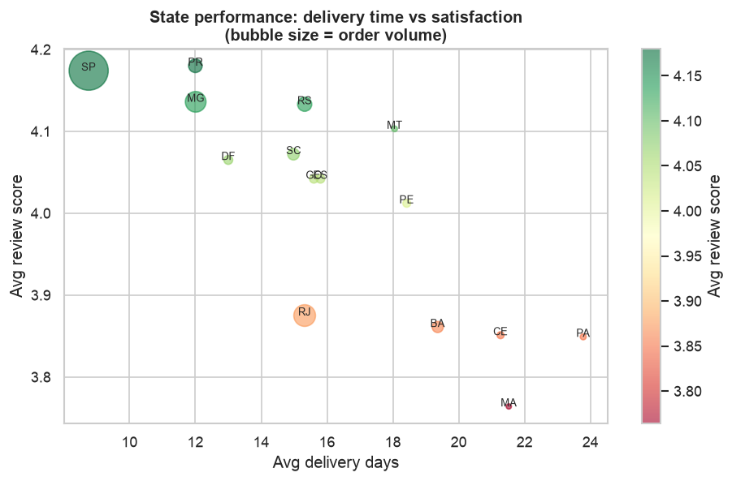
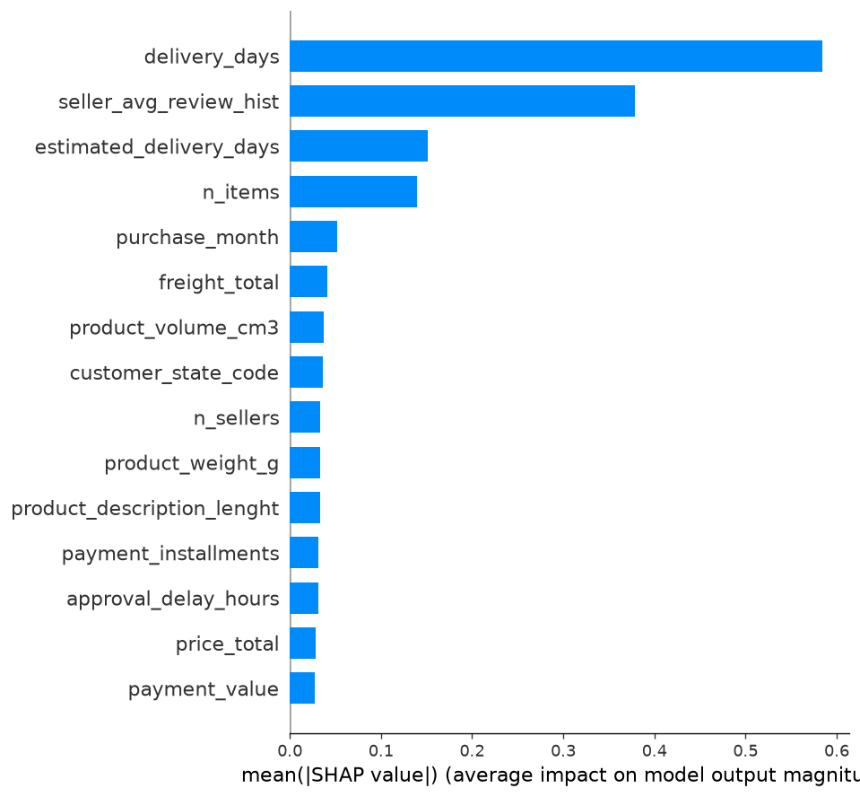

# 📊 Exploratory Data Analysis — OlistTrust

A visual walkthrough of the Brazilian Olist marketplace (~100k orders, 2016–2018).
Every figure below is generated reproducibly by [`src/eda.py`](../src/eda.py) from the
SQLite warehouse — run `python -m src.eda` to regenerate them into `reports/figures/`.

> **TL;DR** — Delivery speed is the single biggest lever on customer satisfaction.
> Orders that arrive **5+ days late average a 1.79★ review** (76.7% negative), while
> orders that arrive **early average 4.31★**. Everything else — price, category,
> region — matters far less than *getting the package there on time*.

---

## 1. Review-score distribution



The marketplace is **heavily skewed toward happy customers** — 5★ reviews dominate —
but there's a meaningful ~21% tail of negative reviews (score ≤ 3). This class imbalance
is exactly why the downstream models use a **time-based split with class weighting**
rather than naive accuracy, and why we report **ROC-AUC / PR-AUC** instead of accuracy alone.

**Why it matters:** a model that always predicts "positive" would be ~79% accurate yet
useless. The imbalance defines the whole modelling strategy.

---

## 2. Delivery lateness vs. satisfaction  ⭐ *the headline insight*


This is the story of the dataset. Bucketing every order by *how early or late it arrived
versus the estimated date* reveals a clean, monotonic relationship:

| Delivery timing | Avg review | % negative |
|---|---|---|
| 5+ days **early** | **4.31★** | low |
| On time | ~4.1★ | moderate |
| 5+ days **late** | **1.79★** | **76.7%** |

A late delivery is the strongest predictor of a bad review in the entire dataset — a
finding later **confirmed independently by SHAP** on the gradient-boosted model
(`delivery_days` is the #1 feature).

---

## 3. Top product categories



The catalog is long-tailed: a handful of categories (*bed/bath, health/beauty,
sports/leisure, furniture, computer accessories*) drive the bulk of order volume. Average
ratings are fairly consistent across categories — reinforcing that **satisfaction is
driven by the fulfilment experience, not the product type**.

---

## 4. State-level performance



Mapping average review score and delivery time by customer state surfaces a clear
**geographic equity gap**. São Paulo (SP) and the south-east — close to Olist's seller and
logistics hubs — enjoy faster deliveries and higher ratings. Remote northern states face
longer transit times and correspondingly lower satisfaction.

**Business takeaway:** regional logistics investment (or smarter delivery-date promises)
would lift satisfaction most in under-served states.

---

## 5. Seller Trust Score distribution


The original **Seller Trust Score** (0–100, defined in [`src/trust/trust_score.py`](../src/trust/trust_score.py))
blends six normalized signals — average review, on-time rate, complaint rate, delivery
speed, order volume, and a cancellation penalty. The distribution separates a large body of
trustworthy sellers (scores 70–95) from a clear high-risk tail below 25, giving the
marketplace an actionable way to **rank and monitor every seller with one transparent number**.

---

## 6. Model explainability — SHAP



Global SHAP importance on the production XGBoost model closes the loop: the features the
model relies on most are exactly the ones EDA flagged — **delivery time dominates**,
followed by the seller's historical review average and the estimated delivery window. The
data story and the model agree, which is the hallmark of a trustworthy model.

---

### Reproduce

```bash
python -m src.etl.build_database   # CSVs -> SQLite warehouse
python -m src.eda                  # regenerate every figure above
```
